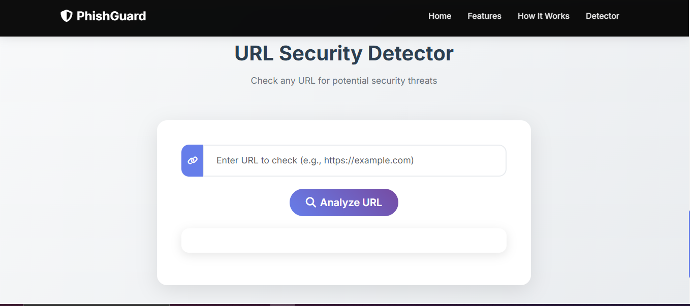

# Phishing Website Detection Using Machine Learning

## Screenshot-1


## Screenshot-2

A comprehensive machine learning-based system for detecting phishing websites by analyzing various URL and website features.

## 🚀 Features

- **30+ Feature Extraction**: Analyzes URLs for suspicious patterns, domain age, SSL certificates, and more
- **Machine Learning Model**: Uses Gradient Boosting Classifier for high-accuracy detection
- **Web Interface**: User-friendly Flask web application for URL testing
- **Real-time Analysis**: Instant phishing detection with confidence scores
- **Comprehensive Detection**: Covers various phishing techniques and red flags

## 🛠️ Technology Stack

- **Backend**: Python, Flask
- **Machine Learning**: Scikit-learn, Gradient Boosting
- **Feature Extraction**: BeautifulSoup, Requests, Python-whois
- **Frontend**: HTML, CSS, Bootstrap, JavaScript
- **Data Processing**: Pandas, NumPy

## 📋 Prerequisites

- Python 3.7+
- pip (Python package installer)
- Internet connection for feature extraction

## 🚀 Installation & Setup

### 1. Clone the Repository
```bash
git clone <repository-url>
cd Phishing-Web-Sites-Detection-Using-Machine-Learning
```

### 2. Install Dependencies
```bash
pip install -r requirements.txt
```

### 3. Train the Model
```bash
python train_model.py
```

This will:
- Load the phishing dataset (`phishing.csv`)
- Train a Gradient Boosting Classifier
- Save the trained model to `pickle/model.pkl`
- Display model performance metrics

### 4. Run the Application
```bash
python app.py
```

The web application will be available at `http://localhost:5000`

## 📊 Dataset

The system uses a dataset with 30 features extracted from URLs:
- **URL-based features**: Length, special characters, subdomains
- **Domain features**: Age, registration length, SSL status
- **Content features**: External links, iframes, popups
- **Behavioral features**: Redirects, form handling, right-click disabling

## 🔍 Feature Extraction

The system extracts 30 features from each URL:

1. **UsingIP** - Checks if URL uses IP address
2. **LongURL** - URL length analysis
3. **ShortURL** - URL shortening service detection
4. **Symbol@** - @ symbol presence
5. **Redirecting//** - Multiple redirects
6. **PrefixSuffix-** - Hyphen in domain
7. **SubDomains** - Number of subdomains
8. **HTTPS** - SSL certificate presence
9. **DomainRegLen** - Domain registration length
10. **Favicon** - Favicon source analysis
11. **NonStdPort** - Non-standard port usage
12. **HTTPSDomainURL** - HTTPS in domain
13. **RequestURL** - External resource requests
14. **AnchorURL** - Anchor tag analysis
15. **LinksInScriptTags** - Script tag links
16. **ServerFormHandler** - Form action analysis
17. **InfoEmail** - Email pattern detection
18. **AbnormalURL** - URL abnormality check
19. **WebsiteForwarding** - Forwarding analysis
20. **StatusBarCust** - Status bar customization
21. **DisableRightClick** - Right-click disabling
22. **UsingPopupWindow** - Popup usage
23. **IframeRedirection** - Iframe presence
24. **AgeofDomain** - Domain age analysis
25. **DNSRecording** - DNS record analysis
26. **WebsiteTraffic** - Alexa rank check
27. **PageRank** - Google PageRank
28. **GoogleIndex** - Google indexing status
29. **LinksPointingToPage** - Incoming links
30. **StatsReport** - Statistical analysis

## 🎯 Usage

### Web Interface
1. Open your browser and go to `http://localhost:5000`
2. Enter a URL in the input field
3. Click "Check here" to analyze the URL
4. View the results and confidence score

### Command Line Testing
```bash
python test_urls.py
```

### Individual URL Testing
```python
from feature import FeatureExtraction
import pickle

# Load model
with open("pickle/model.pkl", "rb") as f:
    model = pickle.load(f)

# Test URL
url = "https://example.com"
obj = FeatureExtraction(url)
features = obj.getFeaturesList()
prediction = model.predict([features])[0]
print(f"Prediction: {'Safe' if prediction == 1 else 'Phishing'}")
```

## 📈 Model Performance

The Gradient Boosting Classifier typically achieves:
- **Accuracy**: 95%+
- **Precision**: High for both safe and phishing classes
- **Recall**: Excellent detection of phishing attempts
- **F1-Score**: Balanced performance across classes

## 🔧 Configuration

Edit `config.py` to customize:
- Flask server settings
- Model parameters
- Feature extraction thresholds
- Suspicious patterns and IPs

## 🧪 Testing

### Test Different URL Types
- **Safe URLs**: Major websites (Google, GitHub, etc.)
- **Suspicious URLs**: New domains, unusual patterns
- **Phishing URLs**: Known malicious sites (for testing)

### Validation
- Test with various URL formats
- Verify feature extraction accuracy
- Check model predictions consistency

## 🚨 Security Considerations

- **Never test with real credentials**
- **Use test URLs only**
- **Be cautious with unknown domains**
- **The system is for educational/detection purposes**

## 📝 API Endpoints

- **GET /** - Main page with URL input form
- **POST /** - URL analysis endpoint

## 🐛 Troubleshooting

### Common Issues
1. **Model not found**: Run `python train_model.py` first
2. **Import errors**: Install dependencies with `pip install -r requirements.txt`
3. **Feature extraction failures**: Check internet connection and URL accessibility
4. **Memory issues**: Reduce batch size in training

### Debug Mode
```bash
python app.py --debug
```

## 🤝 Contributing

1. Fork the repository
2. Create a feature branch
3. Make your changes
4. Add tests if applicable
5. Submit a pull request

## 📄 License

This project is for educational purposes. Use responsibly and ethically.

## 🙏 Acknowledgments

- Dataset contributors
- Open-source community
- Machine learning research community

## 📞 Support

For issues and questions:
1. Check the troubleshooting section
2. Review the code comments
3. Open an issue on GitHub

---

**⚠️ Disclaimer**: This tool is for educational and detection purposes only. Always verify URLs independently and never enter real credentials on suspicious websites.
